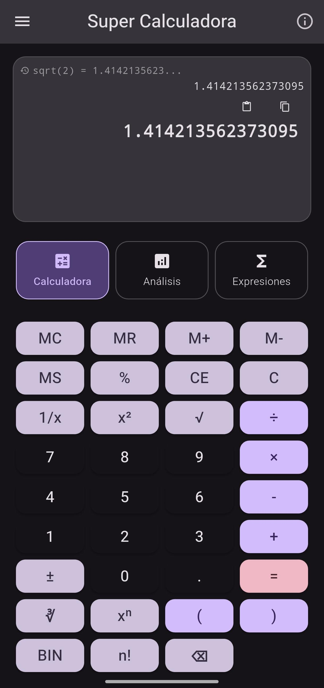
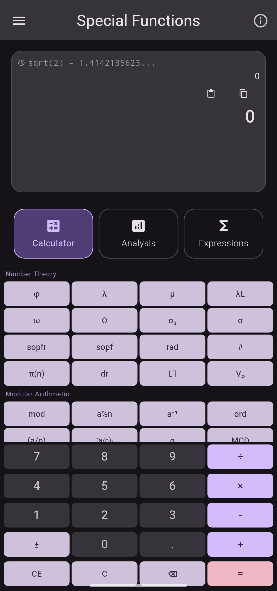

# Super Calculadora

> A powerful open-source calculator for Android with arbitrary-precision arithmetic, number theory functions, and real-time mathematical analysis.

<p align="center">
  
  &nbsp;&nbsp;
  
</p>

<p align="center">
  
  
  
  
</p>

---

## Features

### Calculator Modes
| Mode | Description |
|------|-------------|
| **Standard** | Basic arithmetic with arbitrary-precision BigDecimal engine |
| **Scientific** | Trigonometric, logarithmic, exponential functions; degree/radian toggle |
| **Special Functions** | 100+ advanced mathematical functions (see below) |

### Number Theory Functions
- **Euler's Totient φ(n)** — count of coprimes
- **Carmichael's Lambda λ(n)** — reduced totient (exponent of the multiplicative group)
- **Möbius Function μ(n)** — multiplicative number theory
- **Liouville Function λ_L(n)**
- **Small/Big Omega ω(n)/Ω(n)** — distinct / total prime factor count
- **sopf(n) / sopfr(n)** — sum of prime factors (distinct / with repetition)
- **Radical rad(n)** — product of distinct prime factors
- **Divisor functions σ₀(n), σ(m,n)**
- **Prime-counting π(n)** — exact for n ≤ 10⁶, approximated for larger
- **Primorial n#**, **p-adic valuation Vₚ(n)**

### Modular Arithmetic
- Modular exponentiation `a^b mod n`
- Modular inverse `a⁻¹ mod n`
- Multiplicative order `ord_n(a)`
- Primitive roots
- Legendre symbol `(a/p)` · Jacobi symbol `(a/n)`
- Linear Diophantine equations `ax + by = c`
- Chinese Remainder Theorem (N congruences)

### Combinatorics & Sequences
- Factorial `n!`, Double factorial `n!!`
- Combinations `C(n,k)`, Variations `V(n,k)`
- Fibonacci `F(n)`, Catalan, Bell, Derangement, Partition numbers
- Stirling numbers (1st and 2nd kind)
- Digital root, Digit sum in arbitrary base

### Real-Time Number Analysis Panel
Every number you enter is automatically analyzed:
- Primality test (Miller-Rabin)
- Prime factorization with exponents (e.g. **2³ × 3 × 5²**)
- Perfect power detection (e.g. 8 = 2³)
- Binary / Octal / Hexadecimal representations
- Next and previous prime
- Complete divisor list with count
- All arithmetic functions (φ, λ, ω, Ω, sopf, sopfr, rad, μ, …)
- Number classifications: prime, perfect, abundant, deficient, squarefree, powerful, Harshad, semiprime, Fibonacci, triangular, palindrome…

### Olympiad Tools *(training toolkit for IMO-style problems)*
A dedicated section (from the navigation drawer) with **exact** tools across the four olympiad pillars:
- **Fractions** — exact rational arithmetic, simplify/convert
- **Radicals** — √n and ⁿ√n simplification, denominator rationalization
- **Geometry** — triangle classification, Heron area, circumradius/inradius, shoelace area, Pythagorean & Heronian triples
- **Polynomials** — rational roots, Vieta's relations, discriminant, quadratic/cubic solving
- **Number Theory** — modular square root (Tonelli-Shanks), linear congruences, Pell equation, continued fractions, sums of squares, Frobenius number
- **Step by step** — Euclid, CRT and factorization shown with worked steps
- **Complex & Sequences** — roots of unity, De Moivre, linear recurrences, Pascal triangle

### Other
- **Persistent history** — last 100 operations saved on device
- **Bilingual** — English and Spanish (auto-detected from device locale)
- **Light / Dark / System** theme
- **Copy & Paste** support for large numbers
- Fully **offline** — no internet required, no data collected

---

## Screenshots

| Standard Calculator | Number Analysis |
|---|---|
|  |  |

---

## Installation

### From Google Play *(coming soon)*

### From APK (sideload)
1. Download the latest APK from [Releases](../../releases).
2. Enable "Install from unknown sources" on your Android device.
3. Open the downloaded `.apk` file.

### Build from Source
```bash
# Prerequisites: Flutter 3.x, Android SDK
git clone https://github.com/Adalberto-Garcia-Garces/super_calculadora.git
cd super_calculadora
flutter pub get
flutter build apk --release
# Output: build/app/outputs/flutter-apk/app-release.apk
```

> **Note:** A release signing keystore is required for a signed release build.  
> See [Signing Setup](#signing-setup) below.

---

## Signing Setup

The keystore and `key.properties` are excluded from the repository for security. To build a signed release:

1. Generate your keystore:
```bash
keytool -genkey -v -keystore android/super_calculadora.jks \
  -keyalg RSA -keysize 2048 -validity 10000 \
  -alias super_calculadora
```

2. Create `android/key.properties`:
```properties
storeFile=super_calculadora.jks
storePassword=YOUR_STORE_PASSWORD
keyAlias=super_calculadora
keyPassword=YOUR_KEY_PASSWORD
```

Both files are listed in `.gitignore` and will never be committed.

---

## Project Structure

```
lib/
├── main.dart                           # App entry point, locale & theme setup
├── services/
│   ├── calculator_service.dart         # Main calculation engine
│   ├── special_functions_service.dart  # Number theory implementations
│   ├── number_analysis_service.dart    # Real-time number analysis
│   └── big_decimal.dart                # Arbitrary-precision arithmetic
├── widgets/
│   ├── calculator_display.dart         # Main display with copy/paste
│   ├── number_analysis_panel.dart      # Live analysis panel
│   ├── special_calculator_keyboard.dart
│   └── ...
├── screens/
│   ├── calculator_screen.dart          # 3-tab main screen
│   └── settings_screen.dart
└── l10n/                               # English + Spanish translations
```

---

## Technical Highlights

- **Custom BigDecimal engine** — arbitrary-precision arithmetic without `double` precision loss
- **Isolate-based computation** — heavy operations run off the UI thread
- **Miller-Rabin primality** — probabilistic prime testing with deterministic bases for n < 3.2×10¹⁸
- **Fast Fibonacci** — O(log n) doubling algorithm

---

## Privacy

This app collects **no data whatsoever**. All calculation history and settings are stored locally on your device and are deleted when you uninstall the app.

Read the full [Privacy Policy](PRIVACY_POLICY.md).

---

## Contributing

Pull requests are welcome. For large changes, please open an issue first.

```bash
flutter pub get
flutter analyze   # must pass with zero issues
```

---

## License

[MIT](LICENSE)

---

**Adalberto Garcia Garces**
